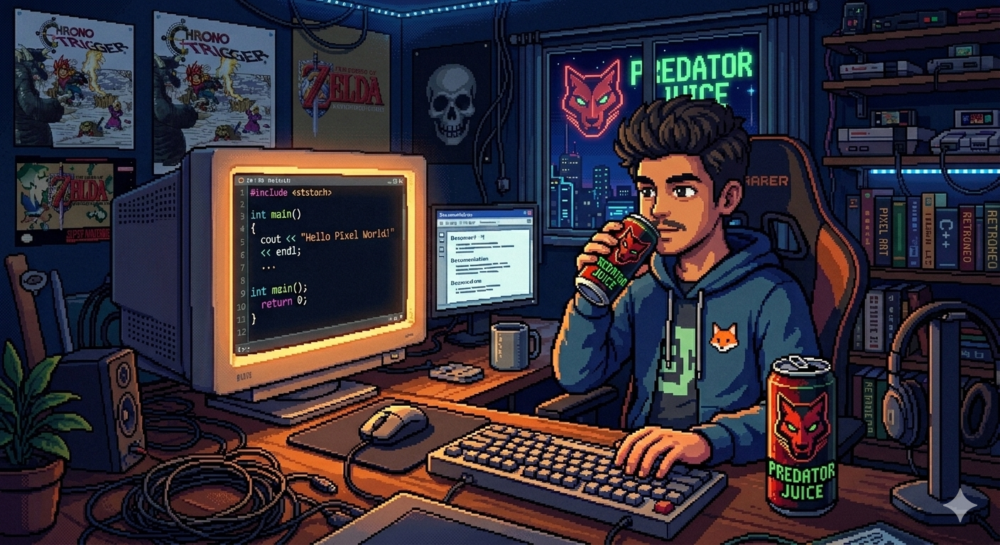

<div align="center">
  
</div>

<div align="center">


<br/>

[](https://santhosh-portfolio-rho.vercel.app)
[](https://linkedin.com/in/santhosh-s-9a7251308)
[](https://github.com/Santhosh121805)
[](mailto:ssanthoshs418@gmail.com)

</div>

---


## ⚡ Who Am I?

> *"I don't just write code. I ship systems."*

I'm **Santhosh S** — a B.Tech CSE-IT student at **REVA University, Bengaluru** (2023–2027), building production-grade AI and full-stack systems that solve real problems.

- 🔭 **Currently:** DevOps Intern @ CodeTechIT Solutions
- 🧠 **Obsessed with:** LLMs, RAG pipelines, AI agents, and cloud architecture
- 🏆 **Decorated:** 4x Hackathon Champion (IIIT-B, BNMIT, BIT, VIT Chennai)
- 🎓 **Mentoring:** AI/ML + Cloud peers at Dev/Track Club (REVA)
- 🌍 **Languages:** English · Kannada · Tamil · Hindi
- 📍 **Based in:** Bengaluru, Karnataka, India

<br clear="right"/>

---

## 🏆 Achievement Wall

<div align="center">

| 🥇 Hackathon | 🏛️ Hosted By | 🎯 Domain |
|:---:|:---:|:---:|
| **Aya Wallet** | IIIT Bangalore | FinTech / AI |
| **UI Path Studio** | BNMIT | Automation / RPA |
| **Ambition** | BIT | Full Stack |
| **Yuvathon** | VIT Chennai | Innovation / AI |

</div>

> 4 wins. Multiple national-level finals. Still hungry.

---

## 🚀 Flagship Projects

### 🛡️ Code-Guardian — Cloud Security AI
> *AWS-native code vulnerability scanner powered by Claude 3.5 Sonnet*

```
┌─────────────────────────────────────────────────────────────┐
│  GitHub Push → ECS Container → Bedrock (Claude 3.5) → Alert │
│  Lambda • S3 • RDS • IAM Policy Mgmt • Docker • CI/CD       │
│  🎯 99.7% Vulnerability Detection Accuracy                   │
└─────────────────────────────────────────────────────────────┘
```
`AWS Lambda` `ECS` `S3` `RDS` `Claude 3.5 Sonnet` `Docker` `CI/CD` `IAM`

---

### 👁️ Lumisight — Diabetic Retinopathy AI
> *AI platform that reads eye fundus images to detect retinopathy — serving India's underserved*

```
┌─────────────────────────────────────────────────────────────┐
│  Eye Image → Deep Learning CV Model → Diagnosis + Chatbot   │
│  FastAPI • React.js • PostgreSQL • Groq LLaMA 3.1           │
│  🌐 5 Indian Languages Supported                             │
└─────────────────────────────────────────────────────────────┘
```
`FastAPI` `React.js` `PostgreSQL` `Deep Learning` `Computer Vision` `Groq` `LLaMA 3.1` `Multilingual`

---

### ⚡ Incident Management System (IMS)
> *Production-grade ops platform that can ingest 10,000 signals/sec*

```
┌─────────────────────────────────────────────────────────────┐
│  10K signals/sec → Redis BullMQ → 10 Async Workers          │
│  State Machine: OPEN → INVESTIGATING → RESOLVED → CLOSED    │
│  MTTR • Prometheus • Grafana • PostgreSQL + MongoDB          │
└─────────────────────────────────────────────────────────────┘
```
`Redis` `BullMQ` `State Machine` `Prometheus` `Grafana` `PostgreSQL` `MongoDB` `REST API`

---

### ✈️ TripAI — Natural Language Travel Booking
> *Tell it where you want to go. It books the trip.*

```
┌─────────────────────────────────────────────────────────────┐
│  "Book me a trip to Goa next Friday" → LLM Intent Parsing   │
│  React.js • Node.js • PostgreSQL • WebSocket • Google OAuth  │
│  🚀 GCP-ready multi-modal transport booking                  │
└─────────────────────────────────────────────────────────────┘
```
`React.js` `Node.js` `PostgreSQL` `WebSocket` `Google OAuth 2.0` `LLM` `GCP`

---

### 💰 Dhan AI — Multilingual Loan Advisory Agent
> *AI agent for India's 1.7 billion unbanked — speaks their language*

```
┌─────────────────────────────────────────────────────────────┐
│  Voice/Text Input → RAG Pipeline → Policy Retrieval → Answer │
│  Sarvam AI • Llama API • 5 Indian Languages                  │
│  🎯 Real-time loan eligibility across regional dialects      │
└─────────────────────────────────────────────────────────────┘
```
`RAG` `Sarvam AI` `Llama API` `LangChain` `Multilingual` `AI Agents`

---

## 🧰 Tech Arsenal

<div align="center">

### Languages


### Frontend


### Backend


### AI / ML


### Cloud & DevOps


### Databases


### Web3


</div>

---

## 📜 Certifications

<div align="center">

| 🏅 Certification | 🏢 Issuer |
|:---|:---|
| Cybersecurity Essentials | Cisco |
| Kubernetes Hands-on Lab | Udemy |
| Cast Away AI — Kubernetes Cost & Performance | Cast AI |
| Artificial Intelligence | Simplilearn |
| Python | Kaggle |
| MongoDB Basics | MongoDB University |
| Oracle Java Foundations | Oracle |

</div>

---

## 💼 Experience

```
╔══════════════════════════════════════════════════════════════════╗
║  🔧 DevOps Intern — CodeTechIT Solutions          Apr–May 2026   ║
║  CI/CD pipelines · Kubernetes clusters · AWS microservices       ║
║  Python & Bash automation scripts                                ║
╠══════════════════════════════════════════════════════════════════╣
║  💻 Full Stack Developer Intern — iSPIRIT      Aug 2025–Jan 2026 ║
║  REST APIs (Node.js + Python) · PostgreSQL/MySQL schema design   ║
║  AI/ML model integration · AWS cloud security architecture       ║
╚══════════════════════════════════════════════════════════════════╝
```

---

## 🧑‍🤝‍🧑 Community & Leadership

- 🎙️ **Secretary & AI/ML Mentor** — Dev/Track Club, REVA University
- 🌐 **Campus Ambassador** — GeeksForGeeks
- ❤️ **Volunteer** — U&I NGO

---

## 📊 GitHub Stats

<div align="center">


</div>

<div align="center">


</div>

---

## 🌐 Let's Connect

<div align="center">

| Platform | Link |
|:---:|:---:|
| 🌐 Portfolio | [santhosh-portfolio-rho.vercel.app](https://santhosh-portfolio-rho.vercel.app) |
| 💼 LinkedIn | [linkedin.com/in/santhosh-s-9a7251308](https://linkedin.com/in/santhosh-s-9a7251308) |
| 🐙 GitHub | [github.com/Santhosh121805](https://github.com/Santhosh121805) |
| 📧 Email | ssanthoshs418@gmail.com |
| 📞 Phone | +91-8792005562 |

</div>


⭐ **If you found any of my work useful, consider starring the repo!**

</div>
